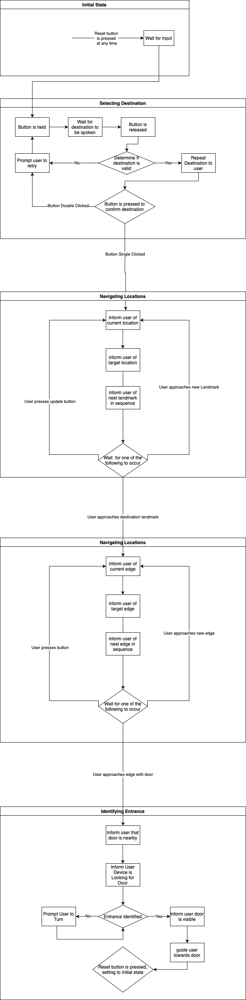
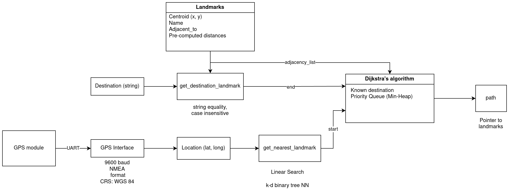
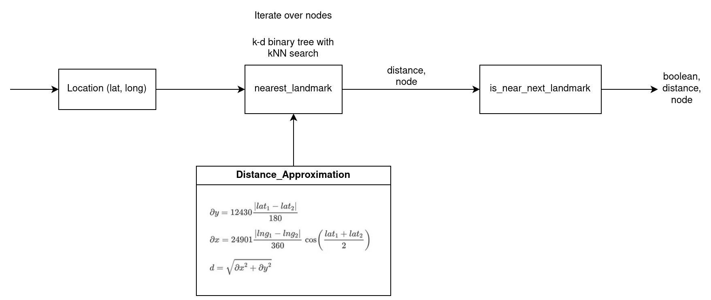

# GuideAndGo

# Brain

The brain is responsible for handling communication between subsystems.

I showed my PCB schematic in lab to Manu.

Here is my subsystem activity diagram:

# Navigation
Justin Lee

Purpose:
Read NMEA messages and parse them from an external GPS device over UART protocal.
Then, using a map stored on the stm32 of the Academic Campus of Purdue Lafayette, finds a path from the current
location to a destination location. Path generated is using "landmark" navigation.

### Activity Diagram

### Notes

Development environment used: stm32CubeIDE with stlink

External libraries used:
    - HAL
    - lwpgs: https://github.com/MaJerle/lwgps

